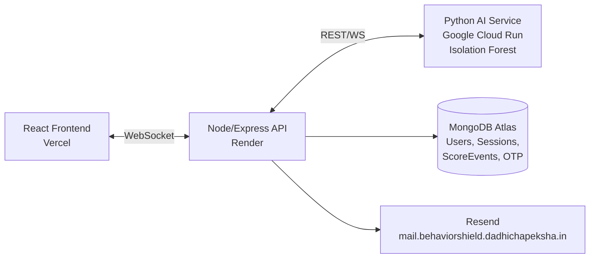

# 🛡️ BehaviorShield

**AI-Powered Continuous Behavioral Authentication**
<<<<<<< HEAD
BehaviorShield is a full-stack security platform that continuously verifies a user's identity *after* login — not just at the login screen. It analyzes how a person types, moves their mouse, and interacts with the app in real time, using an AI model to detect anomalies that could indicate a session takeover or unauthorized access, and automatically forces re-authentication when something looks off.
Think of it as **"Stripe, but for continuous authentication"** — a Behavior-as-a-Service platform that any application can plug into.


## ✨ Features
- **Continuous Authentication** — Monitors keyboard and mouse behavior throughout an active session, not just at login.
- **AI-Powered Anomaly Detection** — A Python microservice running an Isolation Forest model scores each behavioral frame in real time and returns a verdict (`CLEAR`, `STEP_UP_AUTH`, or `CRITICAL_ANOMALY_TERMINATE_SESSION`).
- **Live Trust Score Dashboard** — Real-time speedometer gauge and Recharts sparkline visualizing trust score over the last 10 frames.
- **Smart Force-Logout Logic** — Tracks consecutive anomalous frames with decay-based forgiveness (a clean frame partially offsets past risk) instead of a single bad frame ending the session.
- **Step-Up Re-Authentication (OTP)** — After a forced logout, users must verify their identity via a one-time password sent through a verified custom email domain before regaining access.
- **Session Analytics** — Full session history and behavioral timeline persisted to MongoDB for post-session review.
- **Interactive Behavioral Widgets** — A piano/keyboard and canvas scribble pad used to naturally capture keystroke and mouse-movement biometrics during demos.
- **Real-Time Communication** — WebSocket-based pipeline streams behavioral frames from client → backend → AI service and back.


## 🏗️ URL's
- **Frontend:** `behaviorshield.dadhichapeksha.in`
- **Backend API:** `api.behaviorshield.dadhichapeksha.in`
- **Transactional Email:** `mail.behaviorshield.dadhichapeksha.in` (via Resend)


## 🧰 Tech Stack
- Frontend - React, Vite, Framer Motion, Recharts 
- Backend - Node.js, Express, WebSocket (ws) 
- Database - MongoDB Atlas, Mongoose 
- AI/ML Service - Python, Isolation Forest (scikit-learn) 
- Hosting - Vercel (frontend), Render (backend), Google Cloud Run (AI service) 
- Email - Resend (custom verified domain, DKIM/SPF/MX configured) 


## ⚙️ How It Works
1. **Enrollment** — On first use, the user's baseline keystroke and mouse behavior is captured and stored.
2. **Live Monitoring** — During a session, behavioral events (keystrokes, mouse movement) are streamed over WebSocket in real time.
3. **AI Scoring** — Each frame is sent to the Python AI service, which returns a trust verdict based on deviation from the user's baseline.
4. **Adaptive Response**:
   - `CLEAR` → session continues normally.
   - Repeated anomalies → a warning is shown to the user.
   - Sustained anomalous behavior (7+ consecutive bad frames, with decay for recovery) → the session is force-terminated.
5. **Step-Up Verification** — On re-login after a forced logout, the user must complete OTP verification via email before being granted full access again.
6. **Analytics** — All sessions and per-frame scores are persisted to MongoDB, viewable in a Session Analytics dashboard.


## 🚀 Getting Started
### Prerequisites
- Node.js (v18+)
- MongoDB Atlas account
- Resend account (for email/OTP)
- Python 3.9+ (for the AI service)

### Installation
=======

BehaviorShield is a full-stack Behavior-as-a-Service (BaaS) platform that continuously verifies a user's identity *after* login — not just at it. Instead of relying on a single password check, it watches how you actually type and move your mouse, scores that behavior in real time against your personal baseline, and automatically challenges or logs out sessions that start looking suspicious.

Think of it as **"Stripe, but for continuous security"** — a drop-in behavioral authentication layer any app could plug into.

---

## ✨ Features

### 🔐 Continuous Behavioral Monitoring
- Real-time keystroke dynamics and mouse movement capture via interactive widgets (piano/keyboard tone player, canvas scribble pad)
- Behavioral signals streamed over WebSocket to an AI scoring engine every few seconds
- Live trust-score gauge (speedometer-style, conic-gradient arc) plus a rolling sparkline of the last 10 scored frames

### 🤖 AI Anomaly Detection
- Python microservice using an **Isolation Forest** model to detect deviations from a user's enrolled behavioral baseline
- Three-tier verdict system: `CLEAR`, `STEP_UP_AUTH` (warning), `CRITICAL_ANOMALY_TERMINATE_SESSION`
- Decay-based scoring — a single bad frame doesn't nuke the session, but sustained anomalous behavior (7+ consecutive bad frames) triggers a forced logout

### 🔑 Step-Up Authentication (OTP)
- On forced logout, re-entry is gated behind a one-time password sent via email (Resend, on a custom verified domain)
- Hashed OTP storage, 5-minute expiry, 5-attempt rate limit, 30-second resend cooldown
- Non-disruptive in-session warning modal at early anomaly signs, auto-dismissing on recovery — full OTP challenge only follows an actual force-logout, not mid-session

### 📊 Session Analytics
- Full session history with timeline view of trust-score evolution per session
- Behavioral signal breakdown (keyboard/mouse event counts) per session
- Persisted via MongoDB (`Session` and `ScoreEvent` models) for post-hoc review

### 👤 Profile Management
- User enrollment and baseline calibration flow
- Account-level settings and session overview

---

## 🏗️ Architecture



### Backend Module Breakdown

| Module | Responsibility |
|---|---|
| `routes/auth.js` | Signup/login, JWT issuance |
| `routes/behavior.js` | WebSocket handler — receives live behavioral frames, forwards to the AI service, applies decay logic, triggers force-logout |
| `routes/stepUpAuth.js` | OTP generation, verification, resend, rate limiting |
| `routes/sessions.js` | Session history + timeline REST endpoints for the Session Analytics tab |
| `routes/profile.js` | User profile data |
| `models/User.js` | User account, enrollment status, `requiresStepUp` flag |
| `models/Session.js` | One document per monitoring session |
| `models/ScoreEvent.js` | One document per scored behavioral frame within a session |
| `models/Otp.js` | Hashed OTP, expiry, attempt count |
| `Utils/mailer.js` | Resend email client |
| `Utils/otp.js` | OTP generation/hashing helpers |

**Planned production domains:**
| Service | Domain |
|---|---|
| Frontend (Vercel) | `behaviorshield.dadhichapeksha.in` |
| Backend API (Render) | `api.behaviorshield.dadhichapeksha.in` |
| Transactional email (Resend) | `mail.behaviorshield.dadhichapeksha.in` |

---

## 🛠️ Tech Stack

| Layer | Technology |
|---|---|
| Frontend | React, Vite, Framer Motion, Recharts |
| Backend | Node.js, Express, WebSocket |
| Database | MongoDB Atlas (Mongoose) |
| AI Service | Python, scikit-learn (Isolation Forest) |
| Email/OTP | Resend |
| Hosting | Vercel (frontend), Render (backend), Google Cloud Run (AI service) |

---

## 📂 Project Structure

- `backend/`
  - `models/`
    - `Otp.js`
    - `ScoreEvent.js`
    - `Session.js`
    - `User.js`
  - `routes/`
    - `auth.js`
    - `behavior.js` — WebSocket scoring/persistence handler
    - `profile.js`
    - `sessions.js` — session history + timeline endpoints
    - `stepUpAuth.js` — OTP challenge routes
  - `Utils/`
    - `mailer.js` — Resend integration
    - `otp.js` — OTP generation/hashing/validation
  - `.env.example`
  - `package.json`
  - `server.js`
- `frontend/`
  - `public/`
  - `src/`
    - `assets/`
    - `components/`
      - `CustomCursor.jsx`
      - `Stepupotpmodal.jsx`
    - `context/`
      - `AuthContext.jsx`
      - `BehaviorSocketContext.jsx`
      - `ThemeContext.jsx`
    - `hooks/`
      - `useBehavior.js`
    - `pages/`
      - `AuthPage.css`, `Authvisual.jsx`
      - `Dashboard.css`, `Dashboard.jsx`
      - `Enrollkeyboard.jsx`
      - `Enrollpage.css`, `EnrollPage.jsx`
      - `LandingPage.css`, `LandingPage.jsx`
      - `Livemonitor.jsx`
      - `LoginPage.jsx`
      - `Profile.jsx`
      - `RegisterPage.jsx`
      - `SessionAnalytics.jsx`
    - `App.css`, `App.jsx`
    - `config.js`
    - `index.css`
    - `main.jsx`
  - `.env.example`
  - `eslint.config.js`
  - `index.html`
  - `package.json`
  - `vite.config.js`
- `.gitignore`
- `README.md`

> The Python AI scoring service (Isolation Forest, deployed on Google Cloud Run) lives in a separate repository and communicates with `backend/routes/behavior.js` over WebSocket.

---

## 🚀 Getting Started

### Prerequisites
- Node.js 18+
- Python 3.10+
- MongoDB Atlas connection string
- Resend API key + verified sending domain

### Backend
>>>>>>> d0cb230 (read me updated)
```bash
# Clone the repo
git clone https://github.com/ApekshaDadhich24/AI-Powered-Behavior-Shield.git
cd AI-Powered-Behavior-Shield

# Install backend dependencies
cd backend
npm install
<<<<<<< HEAD

# Install frontend dependencies
cd ../frontend
npm install
```

### Environment Variables
Create a `.env` file in both `backend/` and `frontend/` based on the provided `.env.example` files. Key variables include:

```env
# Backend
MONGO_URI=
RESEND_API_KEY=
JWT_SECRET=
AI_SERVICE_URL=

# Frontend
VITE_BACKEND_URL=
```

### Running Locally

```bash
# Start backend
cd backend
npm run dev

# Start frontend
cd frontend
npm run dev
```


## 📊 Roadmap
- [x] Live behavioral monitoring & trust score engine
- [x] Force-logout & step-up OTP re-authentication
- [x] Session persistence (MongoDB)
- [x] Session Analytics frontend dashboard
- [x] User profile management tab
- [ ] Production deployment & end-to-end testing


## 👩‍💻 Author
**Apeksha Dadhich**
- [GitHub](https://github.com/ApekshaDadhich24)
- [LinkedIn](www.linkedin.com/in/apeksha-dadhich)
=======
cp .env.example .env   # fill in MONGO_URI, RESEND_API_KEY, JWT_SECRET, etc.
node server.js          # or: npm run dev, if a dev script is configured
```

### Frontend
```bash
cd frontend
npm install
cp .env.example .env   # set VITE_BACKEND_URL
npm run dev
```

### AI Service
```bash
cd ai-service
pip install -r requirements.txt
python app.py
```

---

## 🗺️ Roadmap

- [x] Real-time behavioral capture (keyboard + mouse)
- [x] Isolation Forest anomaly scoring pipeline
- [x] Force-logout + OTP step-up authentication flow
- [x] Session Analytics dashboard
- [x] Custom domain email delivery via Resend
- [ ] Static pricing page (SaaS-style tiers, no live payment integration)
- [ ] Public API docs for third-party integration
- [ ] Persistent AI baseline storage (currently lost on Cloud Run scale-to-zero)

---

## 👩‍💻 Author

**Apeksha Dadhich**
[GitHub](https://github.com/ApekshaDadhich24) · [LinkedIn](#)

---

## 📄 License

*(Add your license of choice — MIT is common for portfolio projects.)*
>>>>>>> d0cb230 (read me updated)
